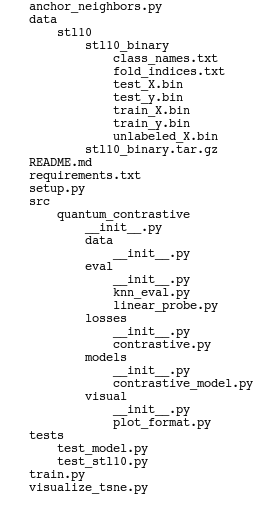

# Quantum Contrastive Representation Learning

This repository implements a classical contrastive learning pipeline for unsupervised visual representation learning, with planned quantum extensions.

## Project Overview

In an era where labeled data is expensive, contrastive learning provides a powerful way to learn meaningful representations without supervision. This project builds a classical baseline on the STL-10 dataset using an InfoNCE loss and a ResNet18 encoder, then explores evaluation through linear probing, k-nearest neighbors, and t-SNE visualization.

Planned extensions include quantum fidelity loss, quantum-enhanced data generation, and quantum kernel methods.

---

## 📁 Directory Structure

